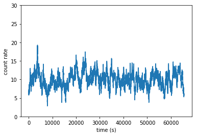
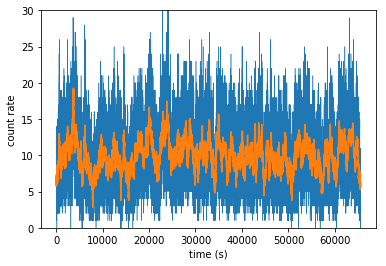
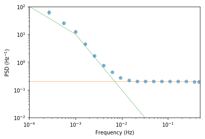

## Examples of using `aztools`
`aztools` is a collection of tools mostly in `python` I have been using over the years to analyze telescope X-ray data. I am putting these out so people my find them useful either as a whole as snippets of code. Also, they out here for the sake of the reproducibility of the published work.

The following examples are meant to get you started.


```python
import aztools as az
import numpy as np
import matplotlib.pylab as plt
```

### Simulting light curves using the `SimLC` class
Using the simulation module includes:
- Create a `SimLC` object, with seed if needed.
- Define the shape of the power spectrum (e.g. `powerlaw`, `broken_powerlaw` etc)
- call `simulate` to generate a random light curve given the defined power spectrum


```python
nlength = 2**16 # number of points desired
dt = 1.0 # sampling time
mu = 10.0 # light curve mean
norm = 'rms' # the normalized of the psd

sim = az.SimLC(seed=393)

# for browen_powerlaw, the parameters are: [norm, index1, index2, break_frequency]
sim.add_model('broken_powerlaw', [1e-5, -1, -2, 1e-3])

sim.simulate(nlength, dt, mu, norm)

```


```python
# plot the light curve #
plt.plot(sim.t, sim.x)
plt.xlabel('time (s)')
plt.ylabel('count rate')
plt.ylim([0, 30])
```


    (0, 30)





- We can add poisson noise for example


```python
y = sim.add_noise(sim.x, dt=dt, seed=345)
plt.plot(sim.t, y, lw=0.5)
plt.plot(sim.t, sim.x)
plt.xlabel('time (s)')
plt.ylabel('count rate')
plt.ylim([0, 30])
```


    (0, 30)





We can now use the `LCurve` functionality to calculate the power spectrum for example.

First, we calculate the raw psd, then we bin it

The binning is done by `az.LCurve.bin_psd`, which in turn calls `az.misc.group_array` of the frequency array, which takes a parameter `fqbin` that defines the type of binning used. Here, we bin by the number of frequency bin (`by_n`), starting with 10 frequencies per bin, and increasing it by a factor of 1.5 every time. See `az.misc.group_array` for details and more grouping options.

`az.LCurve.bin_psd` returns 4 variables:
- `fq`: the binned frequency array.
- `psd`: the binned power spectrum.
- `psde`: the estimated uncertainty on the binned power spectrum.
- `desc`: a dict containing some diagnostic useful information about the binning.


```python
# calculate the raw psd #
freq, raw_psd, noise = az.LCurve.calculate_psd(y, dt, norm)

# bin the psd, and we average in log-space #
fqbin = {'by_n': [10, 1.5]}
fq, psd, psde, desc = az.LCurve.bin_psd(freq, raw_psd, fqbin, noise=noise, logavg=True)


```


```python
# plot the calculated psd.
# also plot the model psd used to generate the light curve in the first place #
plt.errorbar(fq, psd, psde, fmt='o', alpha=0.5)
plt.plot(fq, desc['noise'], lw=0.5)
plt.plot(sim.normalized_psd[0], sim.normalized_psd[1], lw=0.5)
plt.xscale('log')
plt.yscale('log')
plt.xlim([1e-4, 0.5])
plt.ylim([0.01, 1e2])
plt.xlabel('Frequency (Hz)')
plt.ylabel(r'PSD (Hz$^{-1})$')
```


    Text(0,0.5,'PSD (Hz$^{-1})$')





```python

```
